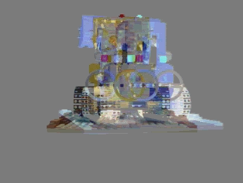
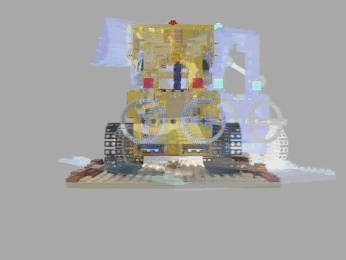
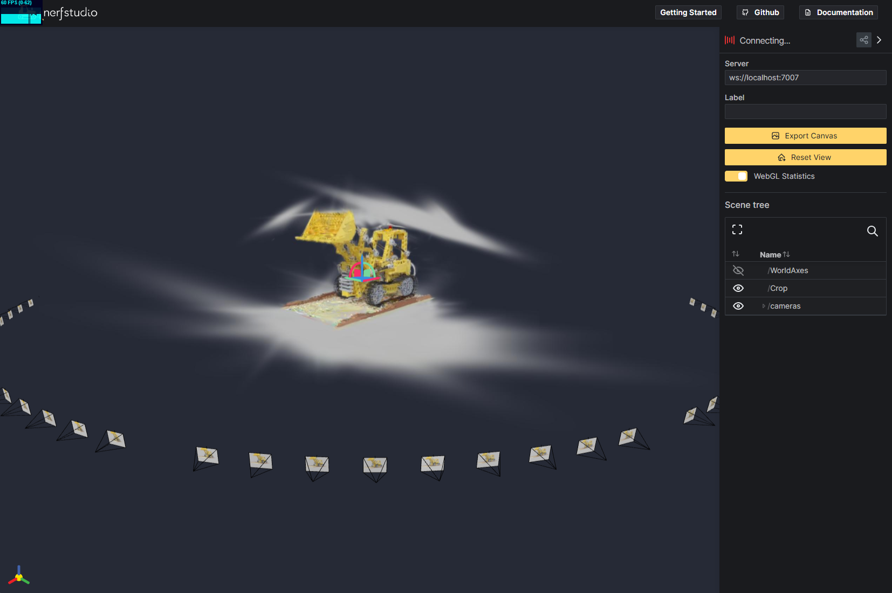
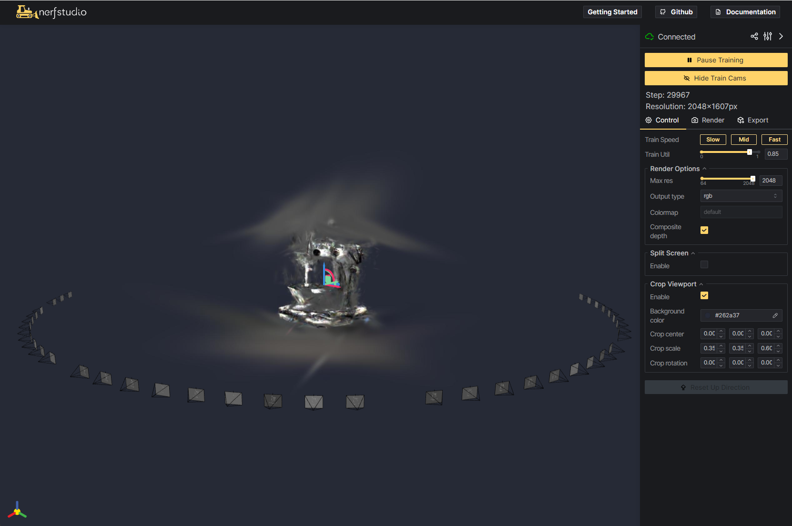
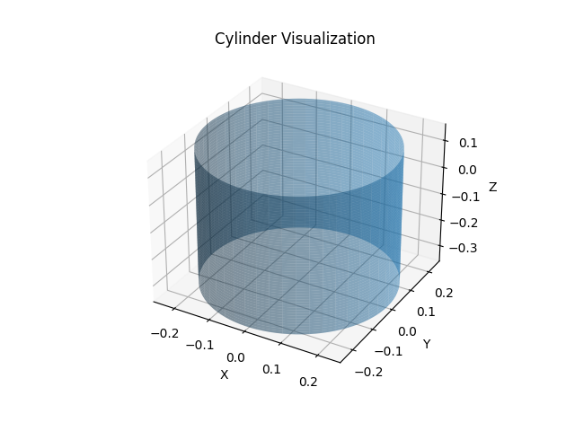

# ESplat: Event Camera 3D Gaussian Splatting
This is the unofficial implementation for [Event3DGS: Event-based 3D Gaussian Splatting for High-Speed Robot Egomotion
(CoRL 2024)](https://arxiv.org/abs/2406.02972). This work was completed as a course project in "CMSC 848B - Selected Topics in Information Processing: Computational Imaging" at the University of Maryland.


<div align='center'> 

</div>

We prepare this repo based on [nerfstudio](https://docs.nerf.studio/) and [EventNeRF](https://github.com/r00tman/EventNeRF), the idea was to train a 3D Gaussian Splatting for event camera data in the nerfstudio pipeline.

<div align='center'> 

</div>

# Installation
ESplat follows the integration guidelines described [here](https://docs.nerf.studio/developer_guides/new_methods.html) for custom methods within Nerfstudio. Update to `nerfstudio==1.0.3`.

<!-- ### 0. Install Nerfstudio dependencies
[Follow these instructions](https://docs.nerf.studio/en/latest/quickstart/installation.html) up to and including "tinycudann" to install dependencies and create an environment -->

### 1. Clone this repo
Give a star before you clone this repo please. [](https://github.com/jayhsu0627/Event3DGS/stargazers)


`git clone https://github.com/jayhsu0627/Event3DGS`

### 2. Install conda env

```
conda env create -f environment.yml
```

### 3. Install this repo as a python package
Navigate to this folder and run `python -m pip install -e .`

### 4. Reinstall gsplat to avoid this [issue](https://github.com/nerfstudio-project/nerfstudio/issues/2727)
Please check your gsplat version by `conda list` before you do this step.

`pip install git+https://github.com/nerfstudio-project/gsplat.git@v0.1.10`
<!-- ### 4. Run `ns-install-cli` -->

### Checking the install
Run `ns-train -h`: you should see a list of "subcommands" with esplatfacto, esplatfacto-big, and esplatfacto-lite included among them.

# Using ESplat
Now that ESplat is installed you can play with it! 

## Pre-process datasets
- Prepare datasets: If you interested the full datasets from EventNeRF, please follow [here](https://github.com/r00tman/EventNeRF) to download the desire datasets `data.tar.gz`. We also prepared a sample data extracted from EventNeRF.

```
data
│   ex2_events_viz.ipynb
│
├───drums
│       events.npz
|   \---pose
├───lego
│       test_lego1_color_init159_1e-6eps.npz
|   \---pose
├───sewing
|       b10_cal1_45rpm_gfox_eonly-2022_05_12_01_17_04_shift_ts1.npz
└───\---pose

```
- We also provided a jupyter notebook `ex2_events_viz.ipynb` for you to visualize the event camera data. [](https://colab.research.google.com/github/jayhsu0627/Event3DGS/blob/main/data/ex2_events_viz.ipynb)

- Preprocess: We designed an EventImageDatamanager to handle the preprocessing of event data. The idea was to sample event data and perform debayering to reconstruct images in nerfstudio format. You'll find a new output folder created within the same scene folder after running this code. This folder contains our nerfstudio format data, which we will use for training in the next stage.


```
python dataloader.py -p data/ -s lego
```

| Frame 0                           | Frame 1                           |
|-----------------------------------|-----------------------------------|
|     |     |
## Train

- Launch training with `ns-train esplatfacto --data <data_folder>`. This specifies a data folder to use. For more details, see [Nerfstudio documentation](https://docs.nerf.studio/quickstart/first_nerf.html). 

```
ns-train esplatfacto --data data/lego/output
```

or
```
ns-train esplatfacto-big --data data/lego/output --pipeline.model.use_scale_regularization True --pipeline.model.cull_alpha_thresh=0.005 --pipeline.model.continue_cull_post_densification=False
```

- Connect to the viewer by forwarding the viewer port (we use VSCode to do this), and click the link to `viewer.nerf.studio` provided in the output of the train script. Use the viewer running locally at: `http://localhost:7007`
- During training, you can use the crop scale in crop viewport to locate the noisy 3DGS model.


| Lego (Synthetic)                            | Sew (Real)                           |
|-----------------------------------|-----------------------------------|
|     |     |


## Known Issues and TODOs

- [ ] The nerfstudio support pointcloud output once you trained a 3DGS, however, we can't make it here right now, since the nerfstudio will verify if the output class is a `SplatfactoModel` instance or not. Instead, we are a `ESplatfactoModel`. Idea: edit `class ExportGaussianSplat(Exporter)` in `exporter.py`.

```
  ns-export gaussian-splat --load-config outputs\plane\esplatfacto\2024-04-22_201709\config.yml --output-dir exports/ply`

  File "C:\Users\sjxu\AppData\Local\miniconda3\envs\event3dgs\lib\site-packages\nerfstudio\scripts\exporter.py", line 614, in entrypoint
    tyro.cli(Commands).main()
  File "C:\Users\sjxu\AppData\Local\miniconda3\envs\event3dgs\lib\site-packages\nerfstudio\scripts\exporter.py", line 536, in main
    assert isinstance(pipeline.model, SplatfactoModel)
AssertionError
```

- [ ] You may discover our result looks floatering compare to the result from papers. **This repo only contains a pure 3DGS implementation**, it's not the same as the CoRL 2024 paper or the EventNeRF paper. The ignored assumption include: (a) no Density Clipping as mentioned in A.2 of EventNeRF paper (b) no or wrong negative sampling

<div align="center">
  <figure>
    
    <figcaption style="text-align: center;">Density Clipping from EventNeRF paper</figcaption>
  </figure>
</div>

- [ ] We can split RGB channels as independent 3DGS.
- [ ] Add t0 and t estimation in prepossing.
- [ ] Untable background (grayscale) coloring in prepossing.


<!-- 
```test

ray_samplers = load_event_data_split(args.datadir, args.scene, camera_mgr=camera_mgr, split=args.train_split,
                                         skip=args.trainskip, max_winsize=args.winsize,
                                         use_ray_jitter=args.use_ray_jitter, is_colored=args.is_colored,
                                         polarity_offset=args.polarity_offset, cycle=args.is_cycled,
                                         is_rgb_only=args.is_rgb_only, randomize_winlen=args.use_random_window_len,
                                         win_constant_count=args.use_window_constant_count)

To see how "load_event_data_split" determine

prev_file = img_files[(i-winsize+len(img_files))%len(img_files)]
curr_file = img_files[i]
``` -->
# Acknowledgements

- The readme template is borrowed from [Lerf](https://github.com/kerrj/lerf).
- Thanks to the work from [EventNeRF](https://github.com/r00tman/EventNeRF).
- The event camera visualizer notebook is borrowed from [events_viz](https://github.com/tub-rip/events_viz/).

# Bibtex
If you find this useful, please cite their paper!
<pre id="codecell0">
@inproceedings{xiong2024event3dgs,
&nbsp;title={Event3dgs: Event-based 3d gaussian splatting for high-speed robot egomotion},
&nbsp;author={Xiong, Tianyi and Wu, Jiayi and He, Botao and Fermuller, Cornelia and Aloimonos, Yiannis and Huang, Heng and Metzler, Christopher},
&nbsp;booktitle={8th Annual Conference on Robot Learning},
&nbsp;year={2024}}
</pre>