## Bayer

In the DAVIS 346C event camera which we use in our experiments, F consists of the following tiled 2×2 pattern (RGGB colour filter):
```[[[1, 0, 0], [0, 1, 0]], [[0, 1, 0], [0, 0, 1]]]```


## Synthetic

### Time frame

For each scene, we render a one-second-long 360◦ rotation of camera around the object at 1000 fps as RGB images, resulting in 1000 views. The maximum timestamp  is $1000$ and the minimum is $0$. Therefore, each incremental timestamp $\Delta t=1$ ms. $\Delta \theta = 360\degree/1000 = 0.36\degree$

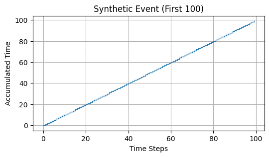


The naming of the synthetic RGB images are in the form of `r_#####.png` where `#` ranging from $00000$ to $01000$, so we have $1001$ images in total.

| t=0ms                         | t=249ms                    | t=499ms                | t=999ms               |
| :---------------------------: | :------------------------: | :--------------------: | :-------------------: |
| 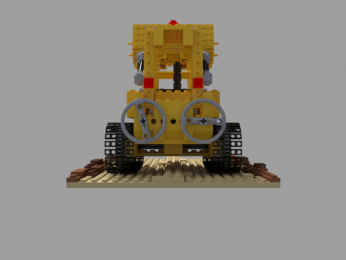        |   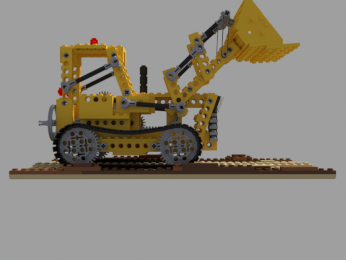   | 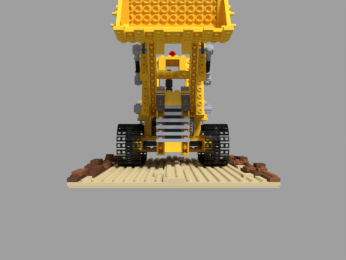 | 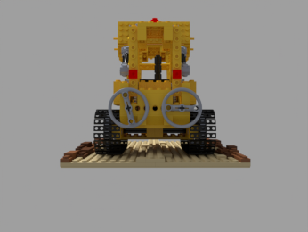|


## Real

### Time frame

We record ten objects with the DAVIS 346C colour event camera on a uniform white background. The maximum timestamp  is $0.99999825$ and the minimum is $0$. The incremental timestamp is $7.50\text{E}-07$ ms.

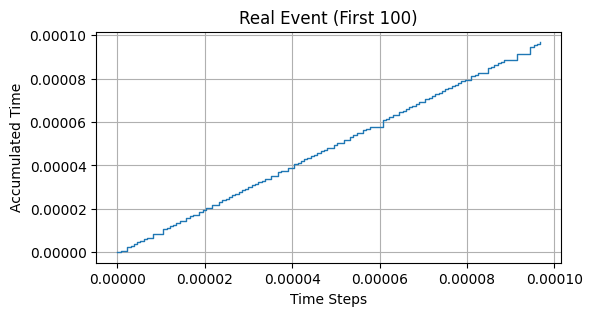

### Camera Pose Calibration
These positions lie on the circle, which corresponds to the correct camera poses, and they are tilted to the rotational axis with an unknown angle offset $\alpha$. In our recordings, we found that $α=2.85\degree$ for the Goatling and Sewing recordings and $\alpha=0.2388\degree$ for the rest of the sequences.

### Density Clipping
For the real scenes, we know that the object always lies inside the cylinder defined by the turntable plate. Hence, to filter the noise and artefacts in the unobserved areas, we force the density to zero everywhere outside of this cylinder:

```math
\sigma(x,y,z) =0 \text{, if } x^2+y^2>r_{max}^2 \text{ or } z>z_{max} \text{ or }  z<z_{min} 
```

The cylinder parameters zmin, zmax and rmax are tuned manually to fit the recorded experimental setup. In our case, $z_{min} = −0.35$, $z_{max}=0.15$ and $r_{max}=0.25$.


```
import numpy as np
import matplotlib.pyplot as plt
from mpl_toolkits.mplot3d import Axes3D

# Define cylinder parameters
z_min = -0.35
z_max = 0.15
r_max = 0.25

# Generate points for plotting
theta = np.linspace(0, 2*np.pi, 100)
z = np.linspace(z_min, z_max, 100)
Z, Theta = np.meshgrid(z, theta)
X = r_max * np.cos(Theta)
Y = r_max * np.sin(Theta)

# Plot cylinder
fig = plt.figure()
ax = fig.add_subplot(111, projection='3d')
ax.plot_surface(X, Y, Z, alpha=0.5)

# Set axis labels
ax.set_xlabel('X')
ax.set_ylabel('Y')
ax.set_zlabel('Z')

# Set plot limits
ax.set_xlim(-r_max, r_max)
ax.set_ylim(-r_max, r_max)
ax.set_zlim(z_min, z_max)

# Show plot
plt.title('Cylinder Visualization')
plt.show()
```

## Loss function


## Number of Events


## Debayer+Deblur


https://www.apertus.org/what-is-debayering-article-october-2015

https://telescope.live/blog/pixinsight-debayer-demosaicing-process-explained

| Input (16x16, C=198)             | Filter Applied                          | CFA                             | Menon2007             |
| :------------------------------: | :-------------------------------------: | :-----------------------------: | :-------------------: |
| 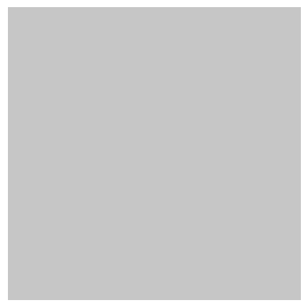|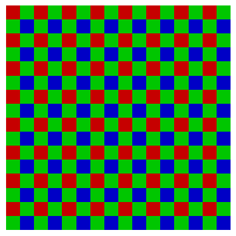| 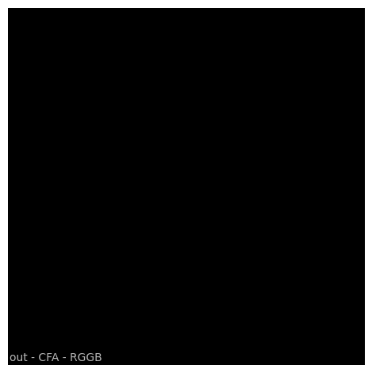 | 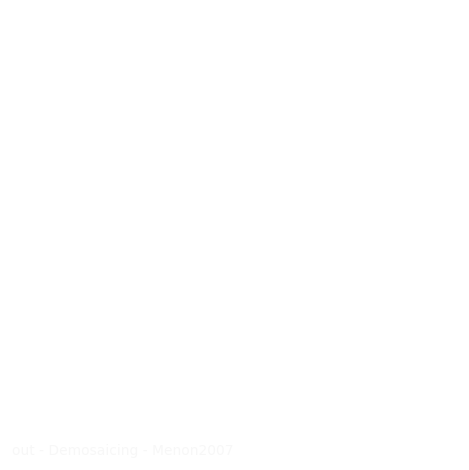|

|               | Debayer               | Debayer+bm4d ($\sigma=6$)   | Debayer+bm4d ($\sigma=10$)     | Menon2007                            |
|:-------------:| :-------------------: | :-------------------------: | :----------------------------: | :----------------------------------: |
|Drum (E=53644) | 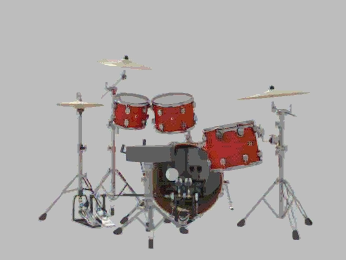||  | |


## Real data more sensitive to timer surface representation

The first 53644 events of synthetic datasets is to simulate a shutter, the following 

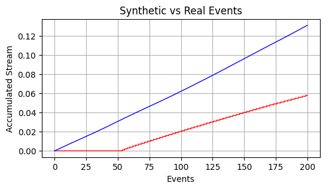